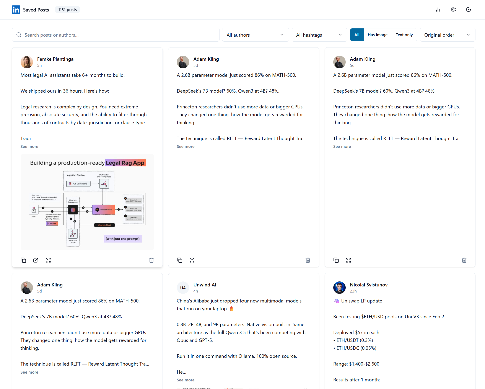
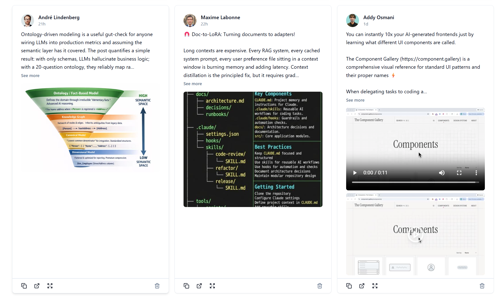
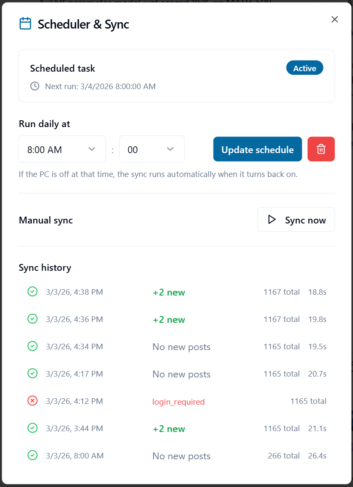
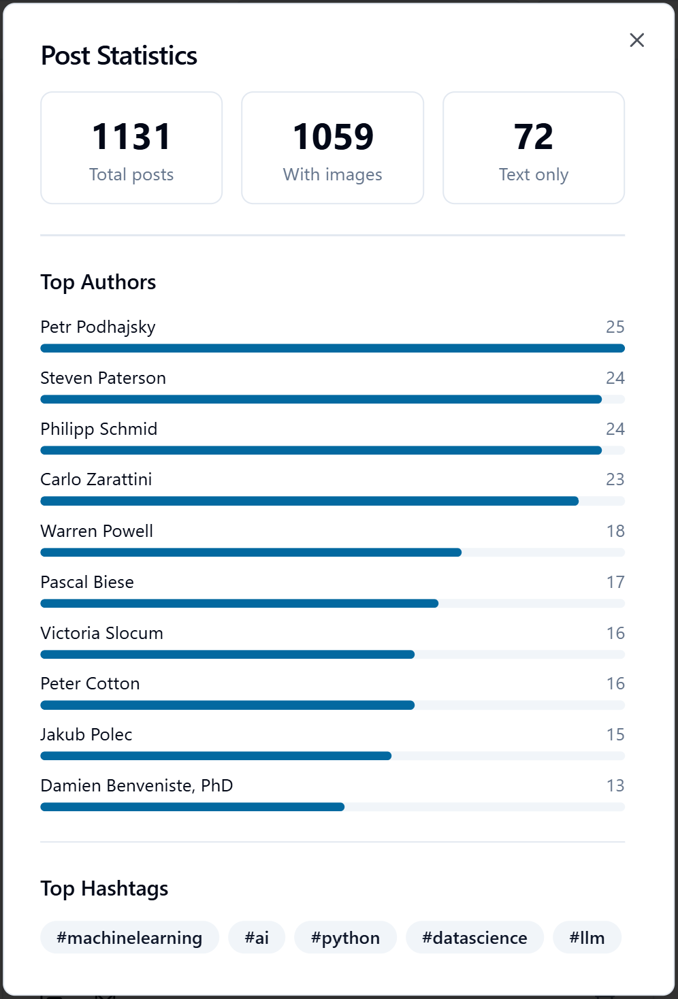

# LinkedIn Saved Posts Scraper & Viewer

Scrapes all of your LinkedIn saved posts (including full-resolution images and videos) and serves them through a polished local browser viewer with search, filters, and dark mode.

## Screenshots





<table>
  <tr>
    <td></td>
    <td></td>
  </tr>
</table>

## Features

- **Full scrape** — downloads all saved posts with text, images, and videos
- **Incremental sync** — only fetches new posts since last run
- **Image quality upgrade** — visits each post page to grab the highest-resolution version from srcset
- **Video download** — captures HLS streams via ffmpeg (MP4)
- **Local viewer** — React + Vite + ShadcnUI with:
  - Keyword search, author filter, hashtag filter, media type filter
  - Sort by original / newest / oldest
  - Dark mode (persisted)
  - Full post detail dialog
  - Delete post / delete all by author
  - Stats panel (top authors, hashtags)
  - Windows Task Scheduler integration for daily auto-sync

## Requirements

- Node.js 18+
- Google Chrome (with a LinkedIn-logged-in profile)
- ffmpeg (for video downloads) — install via `winget install Gyan.FFmpeg`
- Windows (scheduler scripts use `schtasks`)

## Setup

```bash
# 1. Install scraper dependencies
npm install

# 2. Copy and fill in credentials (optional — Chrome session works without them)
cp .env.example .env

# 3. Run the full scraper (first time)
npm run scrape

# 4. Install viewer dependencies and start
cd viewer && npm install && npm run dev
```

## Scripts

| Command | Description |
|---|---|
| `npm run scrape` | Full scrape of all saved posts |
| `npm run sync` | Incremental sync (new posts only), headless |
| `npm run sync:visible` | Incremental sync with visible browser (for manual login) |
| `npm run upgrade` | Upgrade images to highest available resolution |
| `npm run upgrade:videos` | Download MP4 videos for posts with video thumbnails |
| `npm run upgrade:lowres` | Re-upgrade any remaining low-res images |
| `npm run server` | Start the API server (port 3001) |
| `npm run fix:dupes` | Fix duplicate media file references |

## Project Structure

```
├── scraper.js               # Full Playwright scraper
├── scraper-incremental.js   # Incremental sync
├── upgrade-quality.js       # Image quality upgrader
├── upgrade-videos.js        # Video downloader (HLS → MP4)
├── upgrade-lowres.js        # Targeted low-res image upgrader
├── fix-duplicate-refs.js    # Fix colliding media file references
├── server.js                # Express API (delete, scheduler, sync)
├── setup-scheduler.js       # Windows Task Scheduler setup
├── output/                  # Scraped data (gitignored)
│   ├── saved_posts.json
│   └── media/
└── viewer/                  # React + Vite frontend
    └── src/
```

## Configuration

Optionally set these in your `.env` to point to your Chrome profile:

```env
CHROME_USER_DATA=C:/Users/YourName/AppData/Local/Google/Chrome/User Data
CHROME_PROFILE=Profile 2
```

If omitted, defaults to `%LOCALAPPDATA%/Google/Chrome/User Data` and `Default` profile.

Credentials in `.env` are optional — if Chrome is already logged into LinkedIn, the scrapers will use that session directly.

## Notes

- LinkedIn CDN image URLs are HMAC-signed — size variants cannot be swapped directly. `upgrade-quality.js` works around this by visiting each post page and reading the srcset.
- Videos use HLS (`.m3u8`) streaming. ffmpeg is required to download them as MP4.
- The viewer serves `output/` via Vite's `publicDir`, so `npm run dev` inside `viewer/` is all you need.
