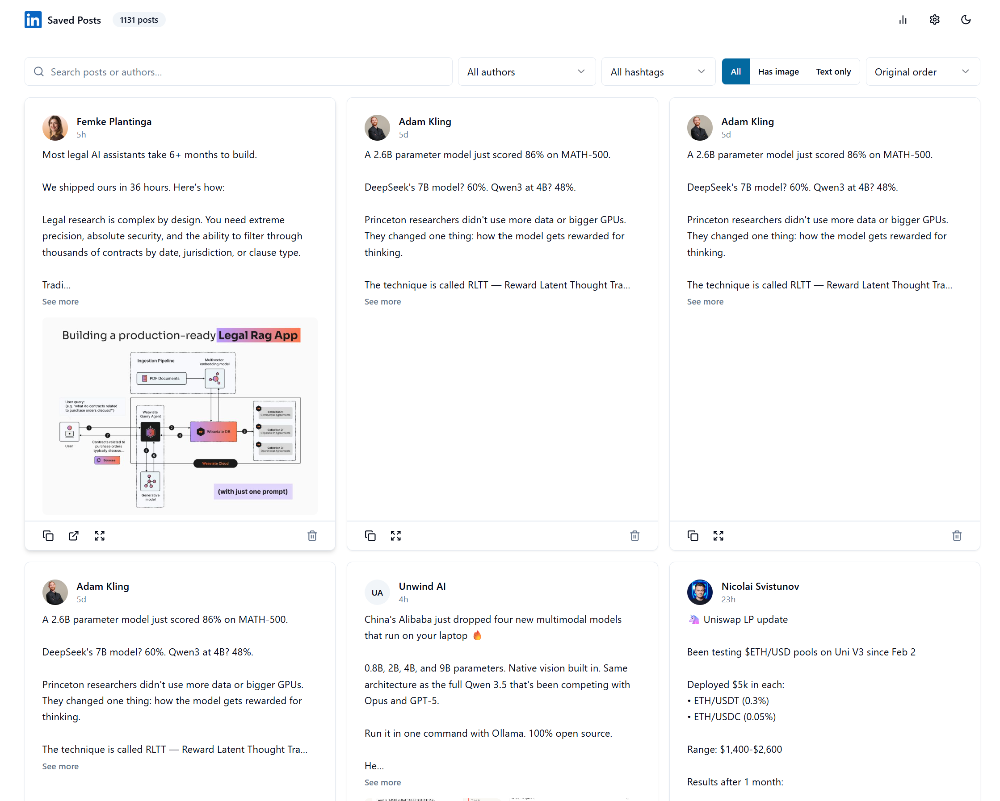
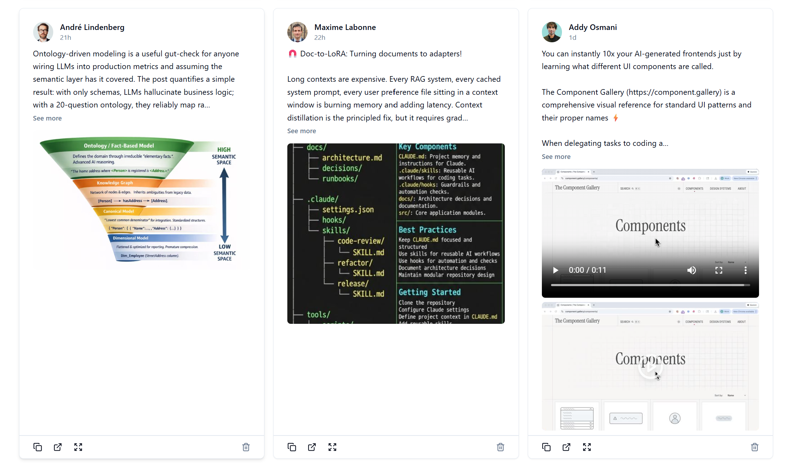
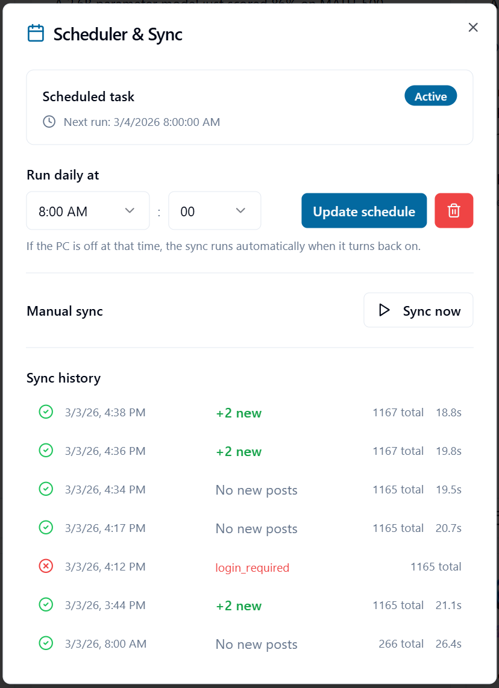
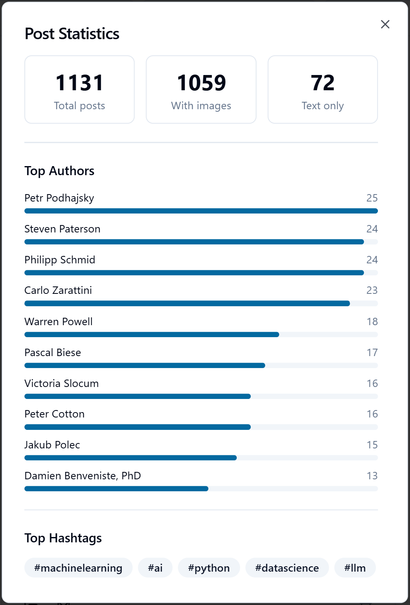

# LinkedIn Saved Posts Scraper & Viewer

Scrapes all of your LinkedIn saved posts (including full-resolution images and videos) and serves them through a polished local browser viewer with search, filters, and dark mode.

## Screenshots





<table>
  <tr>
    <td></td>
    <td></td>
  </tr>
</table>

## Features

- **Full scrape** — downloads all saved posts with text, images, and videos
- **Incremental sync** — only fetches new posts since last run
- **Image quality upgrade** — visits each post page to grab the highest-resolution version from srcset
- **Video download** — captures HLS streams via ffmpeg (MP4)
- **Local viewer** — React + Vite + ShadcnUI with:
  - Hybrid text search using R3 embeddings, keyword recall, and R3 reranking
  - Author filter, hashtag filter, and media type filter
  - Sort by original / newest / oldest
  - Dark mode (persisted)
  - Full post detail dialog
  - Delete post / delete all by author
  - Stats panel (top authors, hashtags)
  - Windows Task Scheduler integration for daily auto-sync

## Requirements

- Node.js 18+
- Google Chrome (with a LinkedIn-logged-in profile)
- ffmpeg (for video downloads) — install via `winget install Gyan.FFmpeg`
- Docker Desktop with NVIDIA GPU support (for AI text search)
- Windows (scheduler scripts use `schtasks`)

## Setup

```bash
# 1. Install scraper dependencies
npm install

# 2. Copy and fill in credentials (optional — Chrome session works without them)
cp .env.example .env

# 3. Run the full scraper (first time)
npm run scrape

# 4. Install viewer dependencies and start
cd viewer && npm install && npm run dev
```

## Scripts

| Command | Description |
|---|---|
| `npm run scrape` | Full scrape of all saved posts |
| `npm run sync` | Incremental sync (new posts only), headless |
| `npm run sync:visible` | Incremental sync with visible browser (for manual login) |
| `npm run upgrade` | Upgrade images to highest available resolution |
| `npm run upgrade:videos` | Download MP4 videos for posts with video thumbnails |
| `npm run upgrade:lowres` | Re-upgrade any remaining low-res images |
| `npm run server` | Start the API server (port 4781) |
| `npm run embed-only` | Generate or update the R3 text embedding index |
| `npm run search:start` | Start the local R3 embedding and reranking services |
| `npm run search:stop` | Stop the local R3 search services |
| `npm run fix:dupes` | Fix duplicate media file references |

## Project Structure

```
├── scraper.js               # Full Playwright scraper
├── scraper-incremental.js   # Incremental sync
├── upgrade-quality.js       # Image quality upgrader
├── upgrade-videos.js        # Video downloader (HLS → MP4)
├── upgrade-lowres.js        # Targeted low-res image upgrader
├── fix-duplicate-refs.js    # Fix colliding media file references
├── server.js                # Express API (delete, scheduler, sync)
├── setup-scheduler.js       # Windows Task Scheduler setup
├── output/                  # Scraped data (gitignored)
│   ├── saved_posts.json
│   └── media/
└── viewer/                  # React + Vite frontend
    └── src/
```

## Configuration

Optionally set these in your `.env` to point to your Chrome profile:

```env
CHROME_USER_DATA=C:/Users/YourName/AppData/Local/Google/Chrome/User Data
CHROME_PROFILE=Profile 2
# LINKEDIN_BROWSER_DATA=./.browser-profile
```

If omitted, defaults to `%LOCALAPPDATA%/Google/Chrome/User Data` and `Default` profile.

The incremental scraper initializes a private dedicated profile at
`.browser-profile`. If LinkedIn expires the session or asks for
verification, run `npm run sync:visible` once and complete the login in the
opened window. That refreshed session is retained for future scheduled syncs.
Credentials in `.env` remain an optional fallback.

## AI text search

AI search is text-only. It uses `tencent/R3-embedding-0.6b` to retrieve a broad
candidate set, combines those results with BM25-style keyword recall, and uses
`tencent/R3-rerank-0.6b` to order the final results.

Generate the initial index once:

```bash
npm run embed-only
```

The first run downloads both models into the Docker volume
`linkedin-r3-model-cache`. When the viewer is running, the model services start
on the first AI search and stop when the viewer is closed. Image files are not
embedded or used for AI search.

## Notes

- LinkedIn CDN image URLs are HMAC-signed — size variants cannot be swapped directly. `upgrade-quality.js` works around this by visiting each post page and reading the srcset.
- Videos use HLS (`.m3u8`) streaming. ffmpeg is required to download them as MP4.
- The viewer serves `output/` via Vite's `publicDir`, so `npm run dev` inside `viewer/` is all you need.
